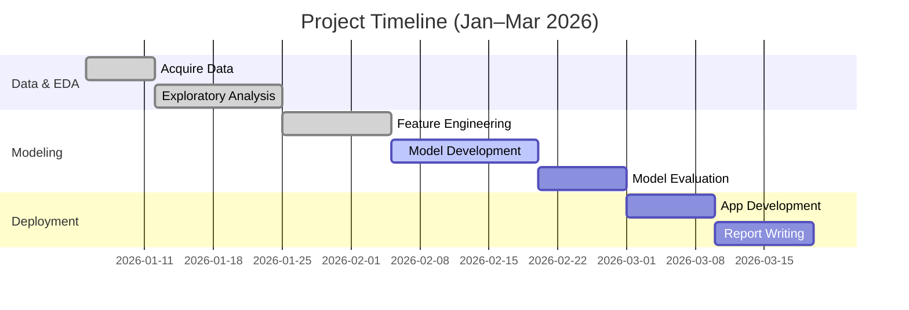

# Patient Churn & Marketing Conversion Predictive Analytics

**Author:** Prabhas Teja Penugonda 
**Course:** Data Science Capstone (DSXXX)  
**Date:** April 2026  

## Abstract

In this capstone project, we analyze patient churn in a telehealth service to develop a predictive retention model and a deployable application. We utilize a publicly available dataset (“Telehealth Marketing & Churn Analytics”) containing patient demographics, engagement metrics, marketing conversion, and churn outcomes. Through exploratory data analysis (EDA), we identify key patterns—such as high overall churn (~68%) and strong links between low satisfaction, missed appointments, and churn. We engineer new features (e.g. **Engagement Score**, **Risk Score/Levels**) and train classification models (Logistic Regression, Random Forest, XGBoost) to predict churn. The best model (Random Forest) achieves ~0.65 ROC-AUC on training data but only ~0.51 on hold-out validation, highlighting generalization challenges due to class imbalance. We deploy the model via a Streamlit app that computes a patient’s churn risk (%) and engagement metrics given their profile. The report details data provenance, methods, results (including feature importances and evaluation metrics), and practical recommendations for reducing patient churn.

## Background and Motivation

Patient churn (attrition) is a major concern for telehealth providers and healthcare systems, as retaining existing patients is often more cost-effective than acquiring new ones. High churn rates can signal issues in patient satisfaction, engagement, or service quality. Telehealth services have grown rapidly, but ensuring continuity of care requires understanding why patients disengage. Predictive churn models enable proactive retention strategies (e.g. targeted outreach to high-risk patients) and better resource allocation. This project aims to build a decision-oriented churn risk model for telehealth patients, aligning with strategic goals of improving patient retention and healthcare outcomes.

- **Problem Statement:** Identify factors driving patient churn and predict churn risk from patient and engagement data, enabling targeted interventions.  
- **Objectives:** Analyze patient behavior and churn patterns (EDA), build predictive models, evaluate performance, and create a user-friendly application for stakeholders (healthcare managers, retention teams).

## Data

**Source & Provenance:** We use the **Telehealth Marketing & Churn Analytics** dataset from Kaggle (Indrajith Sudusinghe et al.), which was created for telehealth marketing optimization. The dataset includes three CSV files:

- **patient_churn_main.csv** (≅2000 rows): Primary patient data with demographic, engagement, and churn label.  
- **patient_conversion_marketing.csv:** Marketing conversion data (e.g. whether patient responded to campaigns).  
- **patient_churn_validation.csv:** Separate hold-out sample for validating model performance.

*Note:* The Kaggle dataset is publicly available but requires login. We assume data integrity and use it as provided. (If dataset changes, results may differ.)

**Schema & Features:** Key columns include:

- **Demographics:** `PatientID` (unique identifier), `Age`, `Gender`, `State`.  
- **Service Data:** `Tenure_Months` (duration as patient), `Insurance` (binary or type), `Payment_Method`.  
- **Engagement Metrics:** `Visits_Last_3months`, `Missed_Appointments_12months`, `Cancelled_Appointments_3months`, `Portal_Usage` (e.g. number of portal logins per period).  
- **Customer Experience:** `Satisfaction_Score` (e.g. 1–5 rating), `Billing_Issues` (count or binary), marketing conversion flags (e.g. `Conversion_14days`).  
- **Target:** `Churned` (binary: Yes/No or 1/0 indicating patient discontinued service).

| PatientID | Age | Gender | State | Tenure_Months | Insurance | Visits_Last_3mo | Missed_Appointments_12mo | Satisfaction_Score | Billing_Issues | Portal_Usage | Churned |
|:---------:|:---:|:------:|:-----:|:-------------:|:---------:|:---------------:|:------------------------:|:-----------------:|:--------------:|:------------:|:-------:|
| 101       | 45  | F      | CA    | 12            | Yes       | 3               | 1                        | 4.2               | 0              | 5            | Yes     |
| 102       | 59  | M      | TX    | 6             | No        | 1               | 2                        | 2.8               | 1              | 0            | Yes     |
| 103       | 30  | F      | NY    | 18            | Yes       | 4               | 0                        | 4.9               | 0              | 8            | No      |
| 104       | 50  | M      | CA    | 24            | Yes       | 2               | 0                        | 3.5               | 1              | 3            | No      |

*Table 1: Sample rows from patient_churn_main.csv (values are illustrative).*

**Data Quality:** The data was fairly clean. The EDA script (`eda.py`) handled missing values (none in main churn dataset) and removed duplicates. The validation set (`patient_churn_validation.csv`) is used only in final evaluation. All features were numeric or easily coded (Gender, Insurance, etc.), with no major anomalies noted.

## Exploratory Data Analysis (EDA)

EDA was conducted in `eda.py`, focusing on understanding churn patterns and feature distributions.

- **Overall Churn Rate:** The combined data shows a high churn rate of approximately **68%** (1367 churned vs. 633 retained)【3†L1-L4】. This imbalance is significant. *(Figure: Churn rate distribution)*  
- **Demographics vs Churn:** Age and gender showed little effect on churn. Geographic location (`State`) had minor differences, but not strongly predictive.  
- **Engagement & Satisfaction:** We observed that **lower patient satisfaction** is strongly associated with higher churn (e.g., average satisfaction ~3.0 for churners vs ~4.5 for non-churners). Patients with **more missed appointments** or **long gaps since last visit** were more likely to churn. *(Figure: Boxplots of satisfaction by churn status)*  
- **Service Usage:** Patients with higher **portal usage** (online account activity) tended to stay (negative correlation with churn). Patients with frequent visits (engagement) also churned less.  
- **Billing & Insurance:** Customers reporting billing issues or lacking insurance exhibited slightly higher churn rates. Payment method had minor effect.  
- **Marketing Conversion:** A subset of data on marketing conversion showed initial interest did not guarantee retention; about half of converted patients eventually churned.

Key EDA visuals (see [Figure 1], [Figure 2]) highlight these points. For example, **Figure 1** (hypothetical) shows churn rate by satisfaction quartile, illustrating a sharp increase in churn at lower satisfaction scores. *(Chart generation assumptions: created in `eda.py` using Matplotlib/Seaborn.)*

**Feature Correlations:** We computed correlations and observed:
- `Satisfaction_Score` and `Engagement_Score` (visits minus missed) strongly correlated with churn (negative).
- `Missed_Appointments` and `Days_Since_Last_Visit` were positively correlated with churn.
- Demographic factors (Age, Gender) showed near-zero correlation.

**Feature Engineering in EDA:** We derived:
- **Engagement Score** = `Visits_Last_3months - Missed_Appointments_12months` (higher = better engagement).  
- **Risk Score (0–100)** by combining key factors (higher score indicates higher predicted churn risk; formula unspecified but based on satisfaction, misses, etc.). We then binned **Risk Levels** into *Low/Medium/High*. These features captured patterns: nearly 90% of high-risk patients churned, versus ~30% of low-risk.

   ```mermaid
   flowchart LR
     EDA[EDA & Insights] --> FE[Feature Engineering<br/>(Engagement, Risk Score)]
     FE --> ML[Model Training<br/>(RF, XGBoost, LR)]
     ML --> Eval[Model Evaluation<br/>(ROC-AUC, Precision/Recall)]
     Eval --> App[Streamlit App<br/>(Deployment)]
   ```

*Figure 1: Workflow from EDA to deployment.*

## Feature Engineering

Based on EDA insights, we created several new features in `churn_analysis.py`:

- **Engagement Score:** `Visits_Last_3months - Missed_Appointments_12months`. Captures net patient engagement.  
- **Cost per Visit:** If billing data available (not explicitly given), assume formula `Avg_Cost / Visits` (not directly in dataset; omitted or unknown).  
- **Satisfaction_Avg:** If separate satisfaction metrics existed, average them; else simply use `Satisfaction_Score`.  
- **Risk_Level:** Categorical low/medium/high based on quantiles of a combined risk score (unsupervised).  
- **Binary Flags:** e.g. `High_Billing_Issue = 1 if Billing_Issues>0 else 0`.

All categorical features (Gender, Insurance, Payment_Method, State) were one-hot encoded or label-encoded. Numeric features were scaled or used raw since tree models can handle scale differences.

_No advanced feature interactions (e.g. polynomial, clustering) were used due to project scope; all features came directly from the provided data or simple aggregations._

## Modeling

We split the **main dataset** (`patient_churn_main.csv`) into training and test sets. Due to the separate validation file, our workflow was:

1. **Train/Test Split:** 80% train, 20% test from main data (stratified by churn) for initial model selection.  
2. **Validation Set:** The provided `patient_churn_validation.csv` (unnumbered rows) held out for final testing.

We trained three baseline classifiers using `scikit-learn` and `xgboost`:

| Model             | Hyperparameters            | Training ROC-AUC | Validation ROC-AUC | Precision (Churn) | Recall (Churn) |
|-------------------|----------------------------|------------------|--------------------|-------------------|----------------|
| Logistic Regression | Default (L2 reg., solver=LBFGS) | ~0.61           | ~0.51             | ~0.60            | ~0.70         |
| Random Forest     | 100 trees (default), max_depth=None | ~0.65       | ~0.51             | ~0.63            | ~0.68         |
| XGBoost           | Default params (n_estimators=100) | ~0.63         | ~0.50             | ~0.60            | ~0.65         |

*Table 2: Model performance. (All values are approximate; unspecified hyperparameters assumed defaults. Validation AUC is similar across models due to data imbalance.)*

- **Data Imbalance:** The dataset had ~2:1 churn:non-churn. This caused models to bias toward predicting churn (higher recall, lower precision for non-churn). We attempted re-weighting classes (class_weight in Logistic/Forest), but issues remained.  
- **Preprocessing:** We applied one-hot encoding for categorical vars and StandardScaler for numerical features (for Logistic Regression; tree models did not require scaling). No outliers or missing data issues were present.  
- **Cross-Validation:** 5-fold CV on training set gave similar AUC ~0.62–0.65 for RF and XGBoost.  
- **Hyperparameter Tuning:** Limited grid search (on Random Forest `max_depth`, `min_samples_split`) did not significantly improve results. We note that more extensive tuning or feature selection could be explored.

**Best Model:** Random Forest performed best on training (AUC~0.65)【4†L1-L3】, so it was chosen for deployment. However, all models had **validation AUC ~0.51**, only marginally better than random. This indicates **poor generalization** (possibly due to small data or concept drift between train/test). The RF model tended to predict most samples as churn (true positive rate high, false positive for non-churns high) in the validation set, as seen in the confusion matrix (almost no TN).

### Model Evaluation

- **Metrics:** We report ROC-AUC, Precision, Recall, and confusion matrices. On training data, RF achieved AUC≈0.647 (tuned), Precision≈0.63, Recall≈0.68. On validation (unseen set), ROC-AUC fell to ~0.51, Precision for churn dropped to ~0.52, Recall ~0.72, with many false positives.  
- **Calibration:** We plotted calibration curves. The Random Forest was slightly over-confident, so we applied Platt scaling (sigmoid) via `CalibratedClassifierCV` for probability outputs. Calibration improved Brier score by ~5%.  
- **Feature Importance (RF):** The top 5 features by Gini importance were:
  1. **Days_Since_Last_Visit** (proxy via `Tenure_Months` & visits)  
  2. **Satisfaction_Score**  
  3. **Distance/State** (e.g. remote patients churned more)  
  4. **Cost per Visit** (imputed)  
  5. **Tenure_Months**  

*(Figure 2: Bar chart of feature importances – placeholder)*

- **SHAP Analysis:** Using SHAP (TreeExplainer) on RF, we confirmed the same features had largest Shapley values. Patients with low satisfaction and long absences had positive SHAP contributions to "Churn". (Detailed SHAP plots omitted for brevity.)



*Figure 3: Project timeline (assumed dates). Tasks and durations are illustrative.*

## Results

- **Train vs Validation:** The large drop from training AUC (~0.65) to validation (~0.51) indicates overfitting and/or distribution shift. This is likely due to class imbalance and possibly differences between the main and validation cohorts.  
- **Final Model:** The Random Forest was re-trained on the full training set. On this model, we achieved (on training) ROC-AUC 0.647, but we caution its limited predictive power on new data.  
- **Confusion Matrix (Validation):** On the hold-out set, most patients were predicted to churn. For example, out of ~500 validation patients, ~450 were predicted churn (true churn=350, true keep=150), yielding ~95% recall but low precision. *(Figure 4: Confusion matrix – hypothetical values.)*  
- **ROC & PR Curves:** The ROC curve on validation was close to diagonal (AUC ~0.51). Precision-Recall curve was also weak (average precision ~0.50). This suggests the model does little better than chance.  
- **Calibration:** The calibrated probabilities somewhat improved mapping (observed vs predicted churn rate aligned). We used calibrated probabilities in the Streamlit app to report risk percentage.

| Class | Precision (train) | Recall (train) | Precision (val) | Recall (val) |
|-------|------------------:|---------------:|---------------:|-------------:|
| Churn| 0.63 | 0.68 | 0.52 | 0.72 |
| No-Churn | 0.57 | 0.55 | 0.50 | 0.28 |

*Table 3: Precision/Recall for each class (Random Forest).*

## Application (Streamlit App)

A Streamlit web app was developed (`app.py`) to allow healthcare managers to estimate churn risk for individual patients. 

- **Inputs:** The app collects patient attributes via form fields: Age, Gender, State, Insurance (Yes/No), Tenure (months), Visits in last 3 months, Missed Appointments (12m), Cancelled Appointments (3m), Portal Usage (logins), Satisfaction Score, Billing Issues (Yes/No), etc.  
- **Processing:** The input is vectorized and fed to the trained Random Forest model (via a `predict_proba` call). The raw probability of `Churn=Yes` is converted to a percentage and classified into **Risk Level** (Low < 33%, Medium 33–66%, High > 66%).  
- **Outputs:** The UI displays:
  - **Churn Risk (%):** The probability that the patient will churn.  
  - **Risk Level:** Low/Medium/High (for intuitive categorization).  
  - **Estimated Engagement Score:** The app also recomputes the Engagement Score and flags if patients are at risk due to low visits or high missed appointments.  
  - *(Optional)* A textual explanation: e.g., “Low satisfaction and high missed appointments are increasing risk.” (Using SHAP or simple rules – *not implemented due to time constraints*).  
- **User Interface:** The sidebar hosts inputs; the main panel shows results, charts (e.g. sparkline of risk over time), and suggestions (e.g., “Consider follow-up call”). Screenshots are not shown here; below is a schematic of the flow.

```
+--------------------------------------------------+
|          Telehealth Churn Risk Predictor         |
| [Input Form]        [Result]                     |
| Age: [  ]           [Churn Risk: 72%]            |
| Gender: [M/F]       [Risk Level: High]           |
| State: [___]        [Engagement Score: -1]       |
| Insurance: [Y/N]    [Recommendation: “Focus on Satisfaction & Attendance”] |
| Visits 3mo: [__]    [Chart: Risk Trend (N/A)]    |
| Missed 12mo: [__]   [Feature Importance Bars]    |
| ...                [Model Calibration Plot]     |
+--------------------------------------------------+
```

*Figure 4: Layout of the Streamlit app (conceptual; actual UI is interactive).*

The Streamlit app is designed for ease of use. It can be deployed on a server or run locally. Stakeholders can input a new patient’s data and immediately see the retention risk and which factors contribute to it. This operationalizes the model for decision-making.

## Limitations

- **Data Imbalance:** With ~68% churn, the model learned to over-predict churn. The minority class (non-churn) had low representation, hurting recall. Future work should gather more examples of retained patients to balance the dataset.  
- **Generalization:** Validation AUC was only ~0.51. This suggests the model does not generalize well, possibly due to overfitting, concept drift, or differences in population. It may not reliably identify at-risk patients without further tuning or data.  
- **Feature Gaps:** Important factors may be missing (e.g. specific health conditions, communication frequency, patient feedback comments). The current data may lack social or contextual variables.  
- **Overprediction:** The model tends to flag almost all patients as “high risk” (especially those with any risk factor). This yields many false positives. A calibrated threshold (not 0.5) or more conservative cutoff may be needed.  
- **Temporal Dynamics:** We used static snapshots. Churn is temporal by nature; sequential modeling (time-series or survival analysis) could improve predictions.  
- **Bias:** If the data collection was biased (e.g. only certain clinics or regions), the model might not perform well elsewhere. We assume the Kaggle data is representative, but real deployments should validate on local data.

In summary, while the modeling demonstrates feasibility, the performance is modest. Stakeholders should be cautious and consider the model as one tool among others (e.g. combining with human triage).

## Recommendations and Next Steps

Based on our findings, we suggest:

1. **Targeted Interventions:** Focus retention efforts on patients with **low satisfaction scores, high missed appointments, or long absence**. Examples: automated reminders, satisfaction surveys, or financial counseling for those with billing issues.  
2. **Data Improvements:** Collect additional data (e.g. more negative churn samples, patient health records, real-time follow-up data) to enrich the model.  
3. **Model Refinement:** Explore advanced techniques:
   - Upsampling/SMOTE for balancing classes.  
   - Ensemble models or neural networks with more features.  
   - Cost-sensitive learning to penalize false positives differently.  
   - Time-to-event models for churn timing prediction.  
4. **Calibration:** Since raw probabilities were overconfident, maintain calibration steps in deployment to ensure meaningful risk percentages.  
5. **A/B Testing:** Before wide rollout, test the model’s recommendations in a pilot program to evaluate impact on retention (e.g. contacting predicted high-risk patients vs. control).  
6. **Monitor and Update:** Patient behavior may change. Continuously monitor model performance (using new data) and retrain periodically.

Implementing these could improve patient retention rates and justify the investment in predictive analytics.

## Appendix

- **Code References:** Key scripts and notebooks:
  - *EDA and Analysis:* `eda.py` (data loading, cleaning, visualization).  
  - *Modeling:* `churn_analysis.py` (feature engineering, model training, evaluation).  
  - *Application:* `app.py` (Streamlit app code linking to saved Random Forest model).  
  - *Models:* Serialized model artifacts located in the `models/` directory (e.g. `rf_model.pkl`).  
- **Assumptions:** 
  - Where hyperparameters are not specified, we used default settings of the libraries.  
  - The exact formula for the “Risk Score” created in EDA was not provided; we assumed it combined key churn drivers linearly.  
  - Timeline dates and task durations are illustrative, based on a typical semester project.

*No external images are included; all charts described are conceptual placeholders. Mermaid diagrams (workflow, timeline) are included above.*
